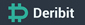
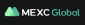

# Crypto API Documentation

## Overview

LLM friendly versions of Crypto Exchange Documentation. Each file is designed to fit within the context windows so analysts / developers / engineers working with these APIs can take full advantage of AI.

## Docs

|                                                                                                             | Exchange           | Documentation                                                                     | Last Updated |
| ----------------------------------------------------------------------------------------------------------- | ------------------ | --------------------------------------------------------------------------------- | ------------ |
|           | Binance Spot       | [Private REST API](docs/binance/spot/private_rest_api.md)                         | 2025-03-14   |
|           | Binance Spot       | [Public REST API](docs/binance/spot/public_rest_api.md)                           | 2025-03-14   |
|           | Binance Spot       | [FIX API](docs/binance/spot/fix_api.md)                                           | 2025-03-14   |
|           | Binance Spot       | [Private WebSocket API](docs/binance/spot/private_websocket_api.md)               | 2025-03-14   |
|           | Binance Spot       | [Market Data SBE API](docs/binance/spot/market_data_sbe_api.md)                   | 2025-03-14   |
|        | Binance USDM       | [Private REST](docs/binance/usdm/private_rest_api.md)                             | 2025-03-14   |
|        | Binance USDM       | [Public REST](docs/binance/usdm/public_rest_api.md)                               | 2025-03-14   |
|        | Binance USDM       | [Private WebSocket](docs/binance/usdm/private_websocket_api.md)                   | 2025-03-15   |
|        | Binance USDM       | [Public WebSocket](docs/binance/usdm/public_websocket_api.md)                     | 2025-03-15   |
|        | Binance CoinM      | [Private REST](docs/binance/coinm/private_rest_api.md)                            | 2025-03-14   |
|        | Binance CoinM      | [Public REST](docs/binance/coinm/public_rest_api.md)                              | 2025-03-14   |
|        | Binance CoinM      | [Private WebSocket](docs/binance/coinm/private_websocket_api.md)                  | 2025-03-15   |
|        | Binance CoinM      | [Public WebSocket](docs/binance/coinm/public_websocket_api.md)                    | 2025-03-15   |
|        | Binance Options    | [Private REST](docs/binance/options/private_rest_api.md)                          | 2025-03-15   |
|        | Binance Options    | [Public REST](docs/binance/options/public_rest_api.md)                            | 2025-03-15   |
|        | Binance Options    | [Private WebSocket](docs/binance/options/private_websocket_api.md)                | 2025-03-15   |
|        | Binance Options    | [Public WebSocket](docs/binance/options/public_websocket_api.md)                  | 2025-03-15   |
|                  | BingX Spot         | [Private REST API](docs/bingx/spot/private_rest_api.md)                           | 2025-04-26   |
|                  | BingX Spot         | [Private WebSocket API](docs/bingx/spot/private_websocket_api.md)                 | 2025-04-26   |
|                  | BingX Spot         | [Public REST API](docs/bingx/spot/public_rest_api.md)                             | 2025-04-26   |
|                  | BingX Spot         | [Public WebSocket API](docs/bingx/spot/public_websocket_api.md)                   | 2025-04-26   |
|               | Bullish            | [Trading API](docs/bullish/trading_api.md)                                         | 2025-06-06   |
|                   | ByBit V5           | [Private REST](docs/bybit/v5/private_rest_api.md)                                 | 2025-03-15   |
|                   | ByBit V5           | [Public REST](docs/bybit/v5/public_rest_api.md)                                   | 2025-03-15   |
|                   | ByBit V5           | [Private WebSocket](docs/bybit/v5/private_websocket_api.md)                       | 2025-03-15   |
|                   | ByBit V5           | [Public WebSocket](docs/bybit/v5/public_websocket_api.md)                         | 2025-03-15   |
|          | Crypto.com         | [Private REST API](docs/cryptocom/private_rest_api.md)                            | 2025-04-26   |
|          | Crypto.com         | [Public REST API](docs/cryptocom/public_rest_api.md)                              | 2025-04-26   |
|          | Crypto.com         | [WebSocket API](docs/cryptocom/websocket_api.md)                                  | 2025-04-26   |
|                       | OKX                | [Private Trading REST](docs/okx/private_order_book_trading_rest_api.md)           | 2025-03-15   |
|                       | OKX                | [Private Trading WebSocket](docs/okx/private_order_book_trading_websocket_api.md) | 2025-03-15   |
|                       | OKX                | [Public Market Data REST](docs/okx/public_market_data_rest_api.md)                | 2025-03-15   |
|                       | OKX                | [Public Market Data WebSocket](docs/okx/public_market_data_websocket_api.md)      | 2025-03-15   |
|                | Gate.io Delivery   | [Private REST Trading API](docs/gateio/delivery/private_rest_trading_api.md)      | 2025-03-28   |
|                | Gate.io Delivery   | [WebSocket API](docs/gateio/delivery/websocket_api.md)                            | 2025-03-28   |
|                | Gate.io Futures    | [Private REST Trading API](docs/gateio/futures/private_rest_trading_api.md)       | 2025-03-28   |
|                | Gate.io Futures    | [WebSocket API](docs/gateio/futures/websocket_api.md)                             | 2025-03-28   |
|                | Gate.io Options    | [Private REST Trading API](docs/gateio/options/private_rest_trading_api.md)       | 2025-03-28   |
|                | Gate.io Options    | [WebSocket API](docs/gateio/options/websocket_api.md)                             | 2025-03-28   |
|                | Gate.io Spot       | [Private REST API](docs/gateio/spot/private_rest_api.md)                          | 2025-03-28   |
|                | Gate.io Spot       | [Private REST Account API](docs/gateio/spot/private_rest_account_api.md)          | 2025-03-28   |
|                | Gate.io Spot       | [Private REST Trading API](docs/gateio/spot/private_rest_trading_api.md)          | 2025-03-28   |
|                | Gate.io Spot       | [WebSocket API](docs/gateio/spot/websocket_api.md)                                | 2025-03-28   |
|                | Gate.io Unified    | [Private REST API](docs/gateio/unified/private_rest_api.md)                       | 2025-03-28   |
|                | Gate.io Unified    | [WebSocket API](docs/gateio/unified/websocket_api.md)                             | 2025-03-28   |
|     | Coinbase Exchange  | [Public REST API](docs/coinbase/exchange/public_rest_api.md)                      | 2025-03-29   |
|     | Coinbase Exchange  | [Private REST API](docs/coinbase/exchange/private_rest_api.md)                    | 2025-03-29   |
|     | Coinbase Exchange  | [WebSocket API](docs/coinbase/exchange/websocket_api.md)                          | 2025-03-29   |
|                 | Bitget             | [Common API](docs/bitget/common_api.md)                                           | 2025-03-31   |
|                 | Bitget             | [Spot API](docs/bitget/spot_api.md)                                               | 2025-03-31   |
|                 | Bitget             | [Futures API](docs/bitget/futures_api.md)                                         | 2025-03-31   |
|                | Bitmart            | [Spot API](docs/bitmart/spot_api.md)                                              | 2025-06-01   |
|                | Bitmart            | [Contract API](docs/bitmart/contract_api.md)                                      | 2025-06-01   |
|                | Bitmart            | [Futures API](docs/bitmart/futures_api.md)                                        | 2025-06-01   |
|               | Deribit            | [Private Account API](docs/deribit/private_account_api.md)                        | 2025-03-31   |
|               | Deribit            | [Private Block Combo Trading API](docs/deribit/private_block_combo_trading_api.md) | 2025-03-31   |
|               | Deribit            | [Private Trading API](docs/deribit/private_trading_api.md)                        | 2025-03-31   |
|               | Deribit            | [Public API](docs/deribit/public_api.md)                                          | 2025-03-31   |
|                     | MEXC Spot          | [Private REST API](docs/mexc/spot/private_rest_api.md)                            | 2025-04-11   |
|                     | MEXC Spot          | [Public REST API](docs/mexc/spot/public_rest_api.md)                              | 2025-04-11   |
|                     | MEXC Spot          | [Private WebSocket API](docs/mexc/spot/private_websocket_api.md)                  | 2025-04-11   |
|                     | MEXC Spot          | [Public WebSocket API](docs/mexc/spot/public_websocket_api.md)                    | 2025-04-11   |
|                     | MEXC Contract      | [Private REST API](docs/mexc/contract/private_rest_api.md)                        | 2025-04-11   |
|                     | MEXC Contract      | [Public REST API](docs/mexc/contract/public_rest_api.md)                          | 2025-04-11   |
|                     | MEXC Contract      | [WebSocket API](docs/mexc/contract/websocket_api.md)                              | 2025-04-11   |
|                     | MEXC Broker        | [Private REST API](docs/mexc/broker/private_rest_api.md)                          | 2025-04-11   |
|                       | HTX CoinM          | [Private REST API](docs/htx/coinm/private_rest_api.md)                            | 2025-04-19   |
|                       | HTX CoinM          | [Public REST API](docs/htx/coinm/public_rest_api.md)                              | 2025-04-19   |
|                       | HTX Spot           | [Private REST API](docs/htx/spot/private_rest_api.md)                             | 2025-04-19   |
|                       | HTX Spot           | [Public REST API](docs/htx/spot/public_rest_api.md)                               | 2025-04-19   |
|                       | HTX Spot           | [FIX API](docs/htx/spot/fix_api.md)                                               | 2025-04-19   |
|                       | HTX Spot           | [Private WebSocket API](docs/htx/spot/private_websocket_api.md)                   | 2025-04-19   |
|                       | HTX Spot           | [Public WebSocket API](docs/htx/spot/public_websocket_api.md)                     | 2025-04-19   |
|                       | HTX USDT-M         | [Private REST API](docs/htx/usdtm/private_rest_api.md)                            | 2025-04-20   |
|                       | HTX USDT-M         | [Public REST API](docs/htx/usdtm/public_rest_api.md)                              | 2025-04-20   |
|                       | HTX USDT-M         | [Private WebSocket API](docs/htx/usdtm/private_websocket_api.md)                  | 2025-04-20   |
|                       | HTX USDT-M         | [Public WebSocket API](docs/htx/usdtm/public_websocket_api.md)                    | 2025-04-20   |
|                 | KuCoin Spot        | [REST API](docs/kucoin/rest/spot_api.md)                                          | 2025-04-26   |
|                 | KuCoin Spot        | [WebSocket API](docs/kucoin/ws/spot_api.md)                                       | 2025-04-26   |
|                 | KuCoin Margin      | [REST API](docs/kucoin/rest/margin_api.md)                                        | 2025-04-26   |
|                 | KuCoin Margin      | [WebSocket API](docs/kucoin/ws/margin_api.md)                                     | 2025-04-26   |
|  | KuCoin Futures     | [REST API](docs/kucoin/rest/futures_api.md)                                       | 2025-04-26   |
|  | KuCoin Futures     | [WebSocket API](docs/kucoin/ws/futures_api.md)                                    | 2025-04-26   |

## Contributing

Feel free to submit PRs for missing crypto venues or endpoints.

## Integration into Cursor

Adding each Doc into Cursor is currently a manual process and is unfortunately time consuming. There is an open feature request for this which
is tracked here: https://forum.cursor.com/t/feature-request-bulk-documentation-import-for-cursor-ai/47539

Once this feature is available in Cursor, I'll add support for adding the docs into this repo.
