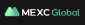

# Exchange TODO List

This file lists the top exchanges based on rankings from CoinMarketCap as of the time of generation, presented in table format. API Documentation links have been added based on search results (please verify). Icon URLs from the ccxt repository have been added where available.

_Note: Icon display depends on the Markdown viewer's ability to render images._

## Top 20 Spot Exchanges

Source: https://coinmarketcap.com/rankings/exchanges/

| Rank | Exchange            | API Documentation                                                          | Icon URL                                                                                                          | Implemented |
| ---- | ------------------- | -------------------------------------------------------------------------- | ----------------------------------------------------------------------------------------------------------------- | ----------- |
| 1    | Binance             | [API Docs](https://developers.binance.com/docs/binance-spot-api-docs)      |                 | ✅          |
| 2    | Bybit               | [API Docs](https://bybit-exchange.github.io/docs/v5/intro)                 |                         | ✅          |
| 3    | Coinbase Exchange   | [API Docs](https://docs.cdp.coinbase.com/exchange/docs/welcome)            |  | ✅          |
| 4    | Upbit               | [API Docs](https://docs-e.upbit.com/)                                      |                         | ❌          |
| 5    | OKX                 | [API Docs](https://www.okx.com/docs-v5/en/)                                |                             | ✅          |
| 6    | Bitget              | [API Docs](https://www.bitget.com/api-doc/common/intro)                    |                       | ✅          |
| 7    | MEXC                | [API Docs](https://mexcdevelop.github.io/apidocs/spot_v3_en/#introduction) |                           | ✅          |
| 8    | Gate.io             | [API Docs](https://www.gate.io/docs/developers/apiv4/)                     |                      | ✅          |
| 9    | KuCoin              | [API Docs](https://www.kucoin.com/docs-new/)                               |                       | ✅          |
| 10   | Crypto.com Exchange | [Private REST API](docs/cryptocom/private_rest_api.md)                     |       | ✅          |
| 11   | Bitfinex            | [API Docs](https://docs.bitfinex.com/docs/introduction)                    |                   | ✅          |
| 12   | BingX               | [API Docs](https://bingx-api.github.io/docs/#/en-us/spot/changelog)        |                        | ✅          |
| 13   | Kraken              | [API Docs](https://docs.kraken.com/api/docs/rest-api/add-order)            |                       | ❌          |
| 14   | Binance TR          | [API Docs](https://www.binance.tr/apidocs/#change-log)                     |                       | ❌          |
| 15   | HTX                 | [Private REST API Docs](docs/htx/spot/private_rest_api.md)                 |                             | ✅          |
| 15.1 | HTX                 | [FIX API Docs](docs/htx/spot/fix_api.md)                                   |                             | ✅          |
| 16   | BitMart             | [API Docs](https://developer-pro.bitmart.com/#introduction)                |                     | ❌          |
| 17   | LBank               | [API Docs](https://www.lbank.com/docs/index.html#introduction)             |                         | ❌          |
| 18   | Bitstamp            | [API Docs](https://www.bitstamp.net/api/)                                  |                   | ❌          |
| 19   | Bithumb             | [API Docs](https://apidocs.bithumb.com/)                                   |                     | ❌          |
| 20   | XT.COM              | [API Docs](https://doc.xt.com/)                                            |                           | ❌          |

## Top 20 Derivatives Exchanges

Source: https://coinmarketcap.com/rankings/exchanges/derivatives/

| Rank | Exchange            | API Documentation                                                            | Icon URL                                                                                                     | Implemented |
| ---- | ------------------- | ---------------------------------------------------------------------------- | ------------------------------------------------------------------------------------------------------------ | ----------- |
| 1    | Binance             | [API Docs](https://developers.binance.com/docs/derivatives/Introduction)     |         | ✅          |
| 2    | OKX                 | [API Docs](https://www.okx.com/docs-v5/en/)                                  |                        | ✅          |
| 3    | Bybit               | [API Docs](https://bybit-exchange.github.io/docs/v5/intro)                   |                    | ✅          |
| 4    | Bitget              | [API Docs](https://www.bitget.com/api-doc/common/intro)                      |                  | ✅          |
| 5    | Deribit             | [API Docs](https://docs.deribit.com/)                                        |                | ✅          |
| 6    | XT.COM              | [API Docs](https://doc.xt.com/)                                              |                      | ❌          |
| 7    | Kraken              | [API Docs](https://docs.kraken.com/rest/)                                    |                  | ❌          |
| 8    | Deepcoin            | [API Docs](https://www.deepcoin.com/docs/authentication)                     |              | ❌          |
| 9    | KuCoin              | [API Docs](https://www.kucoin.com/docs-new)                                  |           | ✅          |
| 10   | MEXC                | [API Docs](https://mexcdevelop.github.io/apidocs/contract_v1_en/#update-log) |                      | ✅          |
| 11   | Bitfinex            | [API Docs](https://docs.bitfinex.com/docs/introduction)                      |              | ❌          |
| 12   | Gate.io             | [API Docs](https://www.gate.io/docs/developers/apiv4/en/#futures)            |                 | ✅          |
| 13   | BitMart             | [API Docs](https://developer-pro.bitmart.com/en/futuresv2/#update-plan)      |                | ❌          |
| 14   | Gemini              | [API Docs](https://docs.gemini.com/rest-api/)                                |                  | ❌          |
| 15   | Crypto.com Exchange | [WebSocket API](docs/cryptocom/websocket_api.md)                             |  | ✅          |
| 16   | HTX                 | [Private REST API](docs/htx/usdtm/private_rest_api.md)                       |                        | ✅          |
| 17   | bitFlyer            | [API Docs](https://lightning.bitflyer.com/)                                  |              | ❌          |
| 18   | BingX               | [API Docs](https://bingx-api.github.io/docs/#/en-us/swapV2/changelog)        |                   | ❌          |
| 19   | LBank               | [API Docs](https://www.lbank.com/docs/index.html#introduction)               |                    | ❌          |
| 20   | DigiFinex           | [API Docs](https://docs.digifinex.com/en-ww/spot/v3/rest.html#introduction)  |            | ❌          |

## Top 20 DEX Spot Exchanges

Source: https://coinmarketcap.com/rankings/exchanges/dex/?type=spot

| Rank | Exchange                | API Documentation                             | Icon URL                                                                                                        | Implemented |
| ---- | ----------------------- | --------------------------------------------- | --------------------------------------------------------------------------------------------------------------- | ----------- |
| 1    | Hyperliquid             | [Link]                                        | [Icon]                                                                                                          | ❌          |
| 2    | OpenOcean               | [Link]                                        |               | ❌          |
| 3    | Uniswap v3 (Ethereum)   | [API Docs](https://docs.uniswap.org/)         |     | ❌          |
| 4    | Raydium (CLMM)          | [Link]                                        |            | ❌          |
| 5    | Uniswap v3 (Arbitrum)   | [API Docs](https://docs.uniswap.org/)         |     | ❌          |
| 6    | Orca                    | [Link]                                        |                         | ❌          |
| 7    | Aerodrome SlipStream    | [Link]                                        | [Icon]                                                                                                          | ❌          |
| 8    | Meteora VD              | [Link]                                        | [Icon]                                                                                                          | ❌          |
| 9    | Uniswap v4 (Ethereum)   | [API Docs](https://docs.uniswap.org/)         |     | ❌          |
| 10   | SynFutures v3           | [Link]                                        | [Icon]                                                                                                          | ❌          |
| 11   | Kine Protocol (Polygon) | [Link]                                        | [Icon]                                                                                                          | ❌          |
| 12   | Vertex Protocol         | [Link]                                        | [Icon]                                                                                                          | ❌          |
| 13   | PumpSwap                | [Link]                                        | [Icon]                                                                                                          | ❌          |
| 14   | PancakeSwap v3 (BSC)    | [API Docs](https://docs.pancakeswap.finance/) |  | ❌          |
| 15   | Curve (Ethereum)        | [API Docs](https://docs.curve.fi/)            |            | ❌          |
| 16   | Aster Simple (BSC)      | [Link]                                        | [Icon]                                                                                                          | ❌          |
| 17   | PancakeSwap v2 (BSC)    | [API Docs](https://docs.pancakeswap.finance/) |  | ❌          |
| 18   | RabbitX                 | [Link]                                        | [Icon]                                                                                                          | ❌          |
| 19   | dYdX v4                 | [Link]                                        |                      | ❌          |
| 20   | Raydium                 | [Link]                                        |                   | ❌          |

## Top 20 DEX Derivatives Exchanges

Source: https://coinmarketcap.com/rankings/exchanges/dex/?type=derivatives

_Note: The retrieved list appears identical to the DEX Spot list based on initial data retrieval. Please verify directly on CoinMarketCap._

| Rank | Exchange                | API Documentation                             | Icon URL                                                                                                        | Implemented |
| ---- | ----------------------- | --------------------------------------------- | --------------------------------------------------------------------------------------------------------------- | ----------- |
| 1    | Hyperliquid             | [Link]                                        | [Icon]                                                                                                          | ❌          |
| 2    | OpenOcean               | [Link]                                        |               | ❌          |
| 3    | Uniswap v3 (Ethereum)   | [API Docs](https://docs.uniswap.org/)         |     | ❌          |
| 4    | Raydium (CLMM)          | [Link]                                        |            | ❌          |
| 5    | Uniswap v3 (Arbitrum)   | [API Docs](https://docs.uniswap.org/)         |     | ❌          |
| 6    | Orca                    | [Link]                                        |                         | ❌          |
| 7    | Aerodrome SlipStream    | [Link]                                        | [Icon]                                                                                                          | ❌          |
| 8    | Meteora VD              | [Link]                                        | [Icon]                                                                                                          | ❌          |
| 9    | Uniswap v4 (Ethereum)   | [API Docs](https://docs.uniswap.org/)         |     | ❌          |
| 10   | SynFutures v3           | [Link]                                        | [Icon]                                                                                                          | ❌          |
| 11   | Kine Protocol (Polygon) | [Link]                                        | [Icon]                                                                                                          | ❌          |
| 12   | Vertex Protocol         | [Link]                                        | [Icon]                                                                                                          | ❌          |
| 13   | PumpSwap                | [Link]                                        | [Icon]                                                                                                          | ❌          |
| 14   | PancakeSwap v3 (BSC)    | [API Docs](https://docs.pancakeswap.finance/) |  | ❌          |
| 15   | Curve (Ethereum)        | [API Docs](https://docs.curve.fi/)            |            | ❌          |
| 16   | Aster Simple (BSC)      | [Link]                                        | [Icon]                                                                                                          | ❌          |
| 17   | PancakeSwap v2 (BSC)    | [API Docs](https://docs.pancakeswap.finance/) |  | ❌          |
| 18   | RabbitX                 | [Link]                                        | [Icon]                                                                                                          | ❌          |
| 19   | dYdX v4                 | [Link]                                        |                      | ❌          |
| 20   | Raydium                 | [Link]                                        |                   | ❌          |

## Top Lending Exchanges

Source: https://coinmarketcap.com/rankings/exchanges/lending/

_Note: Only one exchange could be retrieved from this page during the initial data fetch._

| Rank | Exchange | API Documentation                  | Icon URL                                                                                   | Implemented |
| ---- | -------- | ---------------------------------- | ------------------------------------------------------------------------------------------ | ----------- |
| 1    | Venus    | [API Docs](https://docs.venus.io/) |  | ❌          |
